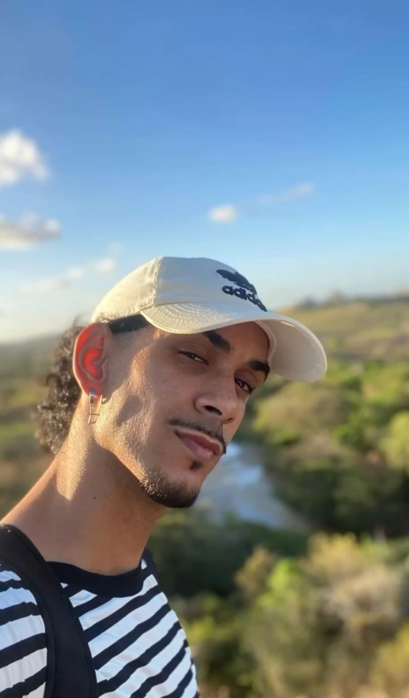

<!-- BANNER -->

<!-- FOTO DE PERFIL -->

  

<h1 align="center">Desenvolvedor & QA | Estudante de Sistemas de Informação</h1>

  Apaixonado por tecnologia, qualidade de software e desenvolvimento.  
  Atualmente cursando Sistemas de Informação no IFS e atuando com testes, automação e desenvolvimento.

---

## 🚀 **Sobre mim**
- 🎓 Bacharelado em **Sistemas de Informação** – IFS (cursando)  
- 🧪 Experiência com **QA Manual e Automação**  
- 💻 Desenvolvedor com foco em **Java, JavaScript e Node.js**  
- 🏆 Finalista Nacional da **OBI** (Olimpíada Brasileira de Informática)  
- ⚡ Apaixonado por resolver problemas e aprender rápido  
- 🎯 Buscando oportunidade como **Jovem Aprendiz na área de TI**

---

## 🛠️ **Tecnologias & Ferramentas**

### **Linguagens**

  
  
  
  
  

### **Ferramentas & QA**

  
  
  
  
  
  

---

## 🏆 **Conquistas**
- 🥇 **1º lugar no IFS** – Olimpíada Brasileira de Informática  
- 🥈 **Vice-campeão – ProgBase / ERBASE**  
- 🏅 **Finalista Nacional – OBI Nível Sênior**  
- 🔥 Top 3 melhor de Sergipe na OBI e único representante do IFS Lagarto  
- 🎯 115º lugar entre 1.940 participantes nacionais  

---

## 📂 **Projetos Destaque**
🔹 **Sistema de Gerenciamento de Usuários (Java + POO)**  
🔹 **Automação de Testes com Selenium + Ruby**  
🔹 **Mini CRUD em JavaScript**  
🔹 **APIs usando Node.js + Insomnia**

> *(Se quiser, posso criar a sessão com links diretos dos seus repositórios.)*

---

## 📈 **Estatísticas do GitHub**

  
  

---

## 📬 **Contato**
📩 **Email:** devluisfernandes@gmail.com  
🔗 **LinkedIn:** linkedin.com/in/luis-fernandes-3a4a15207  
🐙 **GitHub:** github.com/devluizinwxy  
📱 **Telefone:** (79) 99809-2892  

---

